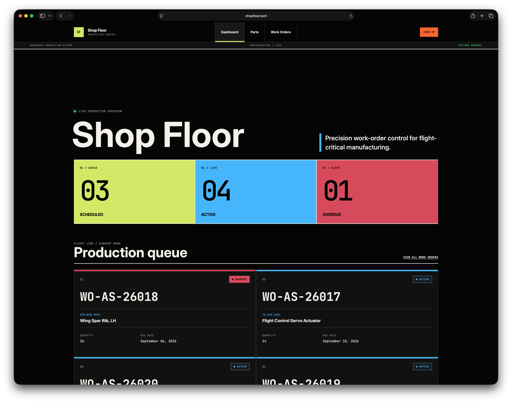

# Shop Floor
> A small manufacturing work-order management application built with Ruby on Rails

Shop Floor is a Ruby on Rails production-control application themed around aerospace manufacturing. It tracks controlled parts, work orders, operation routings, inventory, due dates, and production status through a public operations dashboard. Authenticated operators can create and manage production records.



## Brief
A manufacturer needs a simple way to track work orders and see where each order is in the production process. Shop Floor will allow users to create parts and work orders, assign production operations to those work orders, and track their progress from scheduled work through completion. The application should favor clear business rules, simple interfaces, and standard Rails conventions over a large feature set.

## Features
The first version should support:
- Creating and managing parts
- Creating and managing work orders
- Assigning operations to work orders
- Updating work order and operation statuses
- Viewing active work orders
- Identifying overdue work orders
- Validating important business rules
- Testing the application's core behavior

## Technical Goals
The application should primarily use standard Ruby on Rails:
- Ruby/Rails
- SQLite
- CSS served with Propshaft
- Hotwire
- Minitest
- Git and GitHub
- GitHub Actions for CI
- Kamal for deployment

## Development

```sh
bin/setup
bin/rails server
```

Open [http://localhost:3000](http://localhost:3000).

## Database

Load a representative aerospace program with flight-control, propulsion, structures, avionics, and inspection routings:

```sh
bin/rails db:seed
```

## Tests

Run the complete lint, security, test, and seed checks with `bin/ci`.

```sh
bin/rails test
```
